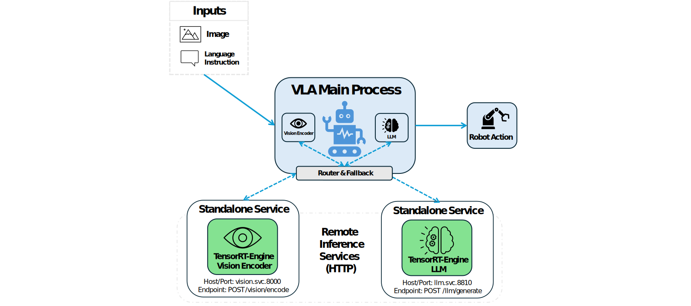
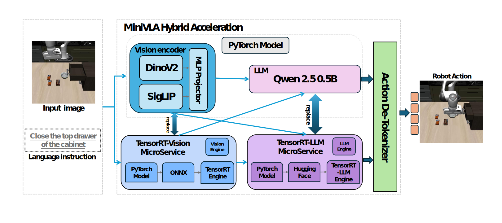
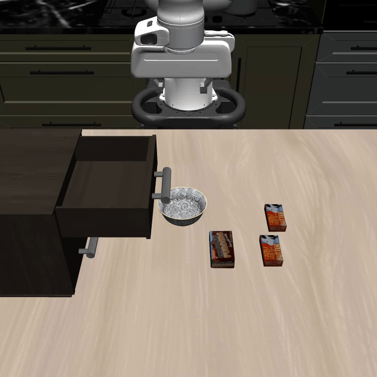

# MiniVLA

<p align="center">
  <a href="https://huggingface.co/xintaozhen/MiniVLA">Hugging Face</a> |
  <a href="#reproduction-guide">Reproduction Guide</a> |
  <a href="#results">Results</a>
</p>


MiniVLA is a lightweight, modular, and deployment-friendly Vision-Language-Action (VLA) framework.  
It is built on top of [OpenVLA-Mini](https://github.com/Stanford-ILIAD/openvla-mini), and further optimized for **edge deployment** through a hybrid acceleration pipeline.  

Key features include:
- ⚡ **TensorRT acceleration**: Vision Encoder and LLM (Qwen-0.5B) exported into ONNX / TensorRT engines, reducing latency and GPU memory usage.  
- 🖥️ **Edge-oriented design**: validated on 8 GB VRAM devices (RTX 4060 Laptop GPU) as a proxy for Jetson Orin Nano, achieving efficient memory utilization and real-time inference.  
- 🌐 **FastAPI-based online service**: transforms offline evaluation scripts into a reusable inference API (`/act`), enabling interactive control.  
- 🔄 **Hybrid PyTorch + TensorRT pipeline**: ensures compatibility and fallback while maximizing acceleration benefits.  

---

## 📦 Installation & Reproduction Guide

This section provides step-by-step instructions to install **MiniVLA** and set up the hybrid acceleration pipeline (TensorRT + PyTorch) for **edge deployment** (e.g., Jetson Orin Nano or 8GB-class GPUs).  

The pipeline includes:
- Installing the MiniVLA project and its dependencies  
- Enabling TensorRT acceleration for the Vision Encoder and LLM  
- Preparing LIBERO for task evaluation  

### Quick Start

```bash
# Step 1: Create conda environment
conda create -n minivla python=3.10 -y
conda activate minivla

# Step 2: Install PyTorch + CUDA (note: safetensors==0.4.3 is required)
conda install pytorch torchvision torchaudio pytorch-cuda=12.4 -c pytorch -c nvidia -y

# Step 3: Clone repository
git clone https://github.com/Zhenxintao/MiniVLA.git
cd MiniVLA

# Install dependencies
pip install -e .

# Step 4: Install flash-attn (for efficient inference, required)
# ⚠️ If you encounter CUDA_HOME errors, please check environment variable setup in Section 4.
pip install packaging ninja
pip install "flash-attn==2.5.5" --no-build-isolation

# Step 5: Install LIBERO simulation platform
git clone https://github.com/Lifelong-Robot-Learning/LIBERO.git
cd LIBERO
pip install -e .

# Step 6: Install LIBERO evaluation dependencies
# ⚠️ Check that 'robosuite' version is exactly 1.4.0
cd ../MiniVLA
pip install -r experiments/robot/libero/libero_requirements.txt

# Step 7: (Optional) Enable Hybrid Acceleration with TensorRT
# Download the pre-exported TensorRT vision encoder engine from Hugging Face:
# https://huggingface.co/xintaozhen/MiniVLA
# After that Run the TensorRT Vision Encoder microservice
cd tensorRT-scripts
python tensorRT_vision_service.py

# Run LIBERO evaluation script
python experiments/robot/libero/run_libero_eval.py \
  --model_family prismatic \
  --pretrained_checkpoint /{Your model checkpoint path} \
  --task_suite_name libero_90 \
  --center_crop True \
  --hf_token HF_TOKEN \
  --num_trials_per_task 20


```
<a id="reproduction-guide"></a>
👉 If you encounter complex environment issues, or want to **reproduce OpenVLA-Mini from scratch** (including CUDA setup, flash-attn, and environment variables), please refer to our detailed reproduction guides:  
- 📄 [English Version](./Results/openvla_mini_reproduction_guide_en.md)  
- 📄 [中文版](./Results/openvla_mini_reproduction_guide.md)  

---

## 📂 Model Weights & Checkpoints

All pretrained weights, TensorRT engines, and Hugging Face–compatible Qwen models are hosted on:  

👉 [Hugging Face: xintaozhen/MiniVLA](https://huggingface.co/xintaozhen/MiniVLA)

This includes:

- `models/`: checkpoints from [Stanford-ILIAD/minivla-vq-libero90-prismatic](https://huggingface.co/Stanford-ILIAD/minivla-vq-libero90-prismatic)  
- `qwen25-0_5b-trtllm/`: TensorRT-LLM formatted Qwen-0.5B  
- `tensorRT/`: Vision encoder ONNX & TensorRT engine  

---

## 🏗️ System Architecture

<p align="center">
  
</p>


### Hybrid Acceleration

<p align="center">
  
</p>


---

## 📑 File Overview

This repository extends **OpenVLA-Mini** with TensorRT-based acceleration and modular deployment. The key files are:

### 1. TensorRT Microservices (`tensorRT-scripts/`)

- `tensorRT_llm_service.py` → Runs the **TensorRT-LLM service** for Qwen-0.5B.  
- `tensorRT_vision_service.py` → Runs the **TensorRT Vision Encoder service**.  
  ⚡ These correspond to the **two standalone microservices** in the architecture diagram.

### 2. VLA Deployment Scripts (`vla-scripts/`)

- `deploy_minivla.py` → Launches MiniVLA with a **FastAPI inference service** (`/act`), enabling image + language prompt based inference.  
- `export_vision_encoder_onnx.py` → Exports the vision encoder into **ONNX format** for TensorRT conversion.

### 3. Experiment Framework (`experiments/robot/`)

- `trt_backbone.py` → TensorRT-accelerated **vision backbone** replacement.  
- `trt_llm_backbone.py` → TensorRT-LLM **LLM backbone** replacement.  
- `openvla_utils.py` & `robot_utils.py` → Implement the **Router & Fallback mechanism**, managing local inference vs. accelerated services.

---

## 🔑 Key Contributions

- Built an **end-to-end online inference framework** with a FastAPI service (`/act`), transforming offline benchmark code into a **real-time deployable system**.  
- Reproduced a lightweight **OpenVLA-Mini** and proposed a **hybrid acceleration pipeline**.  
- Exported the **vision encoder** to TensorRT, reducing perception latency and GPU memory usage.  
- Improved **GPU memory efficiency**: reduced average utilization from ~67% to ~43%, and peak usage from ~85% to ~65%, making deployment feasible under 8 GB memory constraints (similar to Jetson-class devices).  
- Integrated **Qwen 2.5 0.5B** in Hugging Face and TensorRT-LLM formats.  
- Designed a **modular system architecture** with router & fallback for robustness.  
- Demonstrated efficient **edge-side VLA inference** on Jetson Orin Nano in LIBERO tasks, with only a moderate performance drop (5–10%).  

---

## 🖥️ Device & Performance

Target deployment: **Jetson Orin Nano (16 GB / 8 GB variants)**.  

For simulation and reproducibility, experiments were conducted on a **local workstation** equipped with:

- **GPU**: NVIDIA GeForce RTX 4060 Laptop GPU (8 GB VRAM)  
- **Driver / CUDA**: Driver 550.144.03, CUDA 12.4  
- **OS**: Ubuntu 22.04 LTS  

⚠️ **Note**: While the experiments were run on an RTX 4060 Laptop GPU (8 GB VRAM), the device mainly serves as a proxy to evaluate **memory constraints** comparable to Jetson Orin Nano. Absolute inference speed on Jetson devices may be slower due to lower computational power, but the memory utilization trends remain consistent.  

### GPU Memory Utilization (Long-Sequence Tasks)

| Model Variant                           | Avg. GPU Utilization | Peak GPU Utilization |
| --------------------------------------- | -------------------- | -------------------- |
| Original MiniVLA (PyTorch, no TRT)      | ~67%                 | ~85%                 |
| MiniVLA w/ TensorRT Vision Acceleration | ~43%                 | ~65%                 |

---

<a id="results"></a>
## 🎬 Results

We evaluated MiniVLA on **LIBERO desktop tasks**. Below are demonstrations:

<table>
<tr>
<td align="center">
  <b>Close the top drawer of the cabinet</b><br>
  <br>
  ✅ Success (Original): 19/20 <br>
  ⚡ Success (TensorRT Hybrid): 18/20
</td>
<td align="center">
  <b>Put the black bowl in the top drawer of the cabine</b><br>
  <br>
  ✅ Success (Original): 19/20 <br>
  ⚡ Success (TensorRT Hybrid): 18/20
</td>
<td align="center">
  <b>Turn off the stove</b><br>
  <br>
  ✅ Success (Original): 19/20 <br>
  ⚡ Success (TensorRT Hybrid): 18/20
</td>
<td align="center">
  <b>Close the bottom drawer of the cabinet</b><br>
  <br>
  ✅ Success (Original): 19/20 <br>
  ⚡ Success (TensorRT Hybrid): 18/20
</td>
<td align="center">
  <b>Close the top drawer of the cabinet and put the black bowl on top of it</b><br>
  <br>
  ✅ Success (Original): 19/20 <br>
  ⚡ Success (TensorRT Hybrid): 18/20
</td>
</tr>

<tr>
<td align="center">
  <b>Put the yellow and white mug to the front of the white mug</b><br>
  <br>
  ✅ Success (Original): 19/20 <br>
  ⚡ Success (TensorRT Hybrid): 18/20
</td>
<td align="center">
  <b>Pick up the black bowl on the left and put it in the tray</b><br>
  <br>
  ✅ Success (Original): 19/20 <br>
  ⚡ Success (TensorRT Hybrid): 18/20
</td>
<td align="center">
  <b>Pick up the book and place it in the left compartment of the caddy</b><br>
  <br>
  ✅ Success (Original): 19/20 <br>
  ⚡ Success (TensorRT Hybrid): 18/20
</td>
<td align="center">
  <b>Pick up the book in the middle and place it on the cabinet shelf</b><br>
  <br>
  ✅ Success (Original): 19/20 <br>
  ⚡ Success (TensorRT Hybrid): 18/20
</td>
<td align="center">
  <b>Pick up the book on the left and place it on top of the shelf</b><br>
  <br>
  ✅ Success (Original): 19/20 <br>
  ⚡ Success (TensorRT Hybrid): 18/20
</td>
</tr>
</table>


---

## 🔗 Related Links

- 📄 Hugging Face weights: [xintaozhen/MiniVLA](https://huggingface.co/xintaozhen/MiniVLA)  
- 🧑‍💻 Base repo: [Stanford-ILIAD/openvla-mini](https://github.com/Stanford-ILIAD/openvla-mini)  
